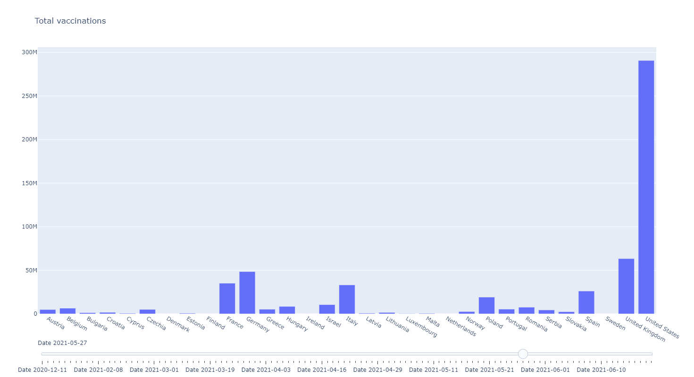
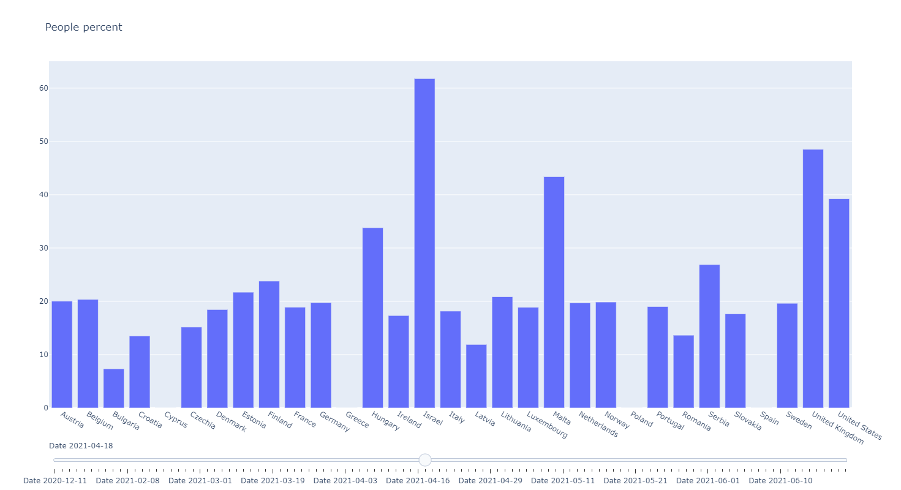
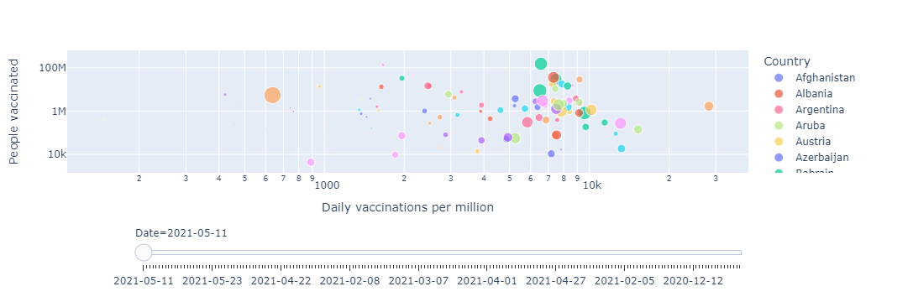
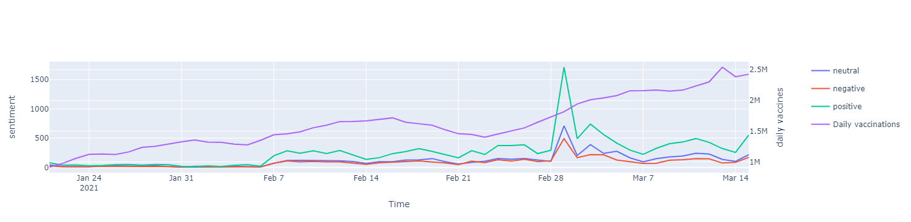

# Vaccine Sentimental Analysis with Tweets

## Table of Contents

- [Project Description](#project-description)
- [Function of Code](#function-of-code)
- [Implementation](#implementation)
- [Datasets](#datasets)
- [Sentiment Models](#sentiment-models)
- [Vaccination Progress Data Analysis](#vaccination-progress-data-analysis)
- [Usage](#usage)
- [Limitation](#Limitation)
- [Contributing](#contributing)
- [License](#license)
## Project Description

We performed sentiment analysis with a collected COVID-19 vaccines related tweets dataset to analyze the sentiment of the overall public discussion. Moreover, correlation analysis with the vaccine progress dataset and the result of sentiment analysis was also conducted to provide an overview of how the sentiments in public discussion are correlated with vaccine progress. The datasets we used include tweets about people’s perspectives on different kinds of vaccines, the number of different vaccinations per day, week, month, and countries over the number of people being vaccinated.

## Function of Code

Our code has two primary functions. One is to perform sentiment analysis on tweets about COVID-19 vaccines by using the dataset of worldwide tweets sentiments. The other one is to implement correlation analysis on the vaccination progress data to discover correlations among various factors, such as vaccination rates, daily vaccination numbers among many different countries, and so on. By getting the results, we are able to see an overall picture of the relationship between vaccination rates and people’s discussions on Twitter. Therefore, for future use, we could collect new tweets about COVID-19 vaccines, apply the trained model onto them to get sentiment labels, and predict the following possible trend of vaccination rate based on the patterns found through the correlation analysis.

## Implementation
### Datasets

> **tweets_covid_all_vaccinations**: all tweets about the COVID-19 vaccines used in entire world and they all include vaccine brands such as Pfizer/BioNTech, Sinopharm, Sinovac, Moderna and etc.

> **tweets_extraction**: the extraction data of tweets includes sentiment label for each of the text and marked each as positive, neutral or negative.

> **tweets_world_vaccination**: data includes daily and total vaccination for COVID-19 in the world such as country, date, number of vaccinations

### Sentiment Models

Import the packages and upload the datasets of **tweets_covid_all_vaccinations** and **tweets_extraction**. Using the function of **remove** to remove things such as URLs, hashtags, emojis and append and merge the two datasets with text and sentiment columns only. We transformed negative, positive, and neutral sentiments to 0, 1, and 2 correspondingly for further modeling. Next, we tokenized the texts and performed lowercase, punctuation removal, small token removal, stop words removal, lemmatization, and stemming to them. The only left columns for tweets include **original text**, **sentiment**, **final text**, and **text tokens**. 

Applied **Naive Bayes** to the dataset and obtained an accuracy of 0.6260 and another baseline model **XGBoost** which gives the test accuracy of 0.696 and trainning accuracy of 0.768 around with multiple XGB models. The third method is deep learning based model **CNN** to train the sentiment of negative, positive, neutral. Word2vec is a model pre-trained on a large corpus. It provides embeddings that map words that are similar close to each other. A quick way to get a sentence embedding for our classifier is to average word2vec scores of all words. There are totally 21270 unique tokens after vectorization. For the function of ConvNet, the embeddings matrix is passed to embedding_layer. There are five filter sizes applied and GlobalMaxPooling1D layers are applied to each layer. All the outputs are then concatenated. For the **model.summary()**, it will print a brief summary of all the layers with there output shapes. Finally, the number of epochs is the amount to that the model will loop around and learn. The batch size is the amount of data that the model sees at a single time.

### Vaccination Progress Data Analysis

We collected two data sets: vaccination progress data set and twitter vaccination related text data set. In the first part of the analysis, we visualize and analyze the evolution of the vaccination progress. In the first figure, we showed a dynamic visualization of total vaccinations in different countries on different dates. Here the the date is 2021-05-27, we can see that among all the given countries, United States have the largest number of vaccinations which is close to 300M. The United Kingdom takes the second largest number of total vaccinations and the number is comparable to that of Germany and France. By the visualization, we can also find that the vaccination statistics from the United States may be the a good fit the study in the next step because it has the most complete and robust vaccination statistics.

We also visualized the total percent of vaccinated people for different countries on different dates so that we can better compare the vaccination progress including countries with different scales of population. Here we can see the percent of people vaccinated for different countries on 2021-04-18. It is shown that Israel has the largest percent of vaccinated people because Israel is among the countries starting vaccination progress at a very early time. And we can see that the United States and some European countries also have a great vaccination progress.

We also drew figures that combing "population of people vaccinated", "daily vaccinations per million", "percent of people fully vaccinated" in the same figure. Here the size of the cluster is the "Percent of fully vaccinated people" and the chosen date is 2021-5-11. This figure includes more small countries than shown in the last figure. Israel is the cluster shown in the upper left part and it is shown that it has the largest size because it has the largest percent of fully vaccinated people. 

### Sentiment Analysis and Correlation Analysis

In this study, we make use of the CNN model trained as mentioned in the Sentiment Model section and predict the sentiments of Twitter texts from 2021-1-21 to 2021-3-15. Then we get the number of positive, negative, and neutral sentiment twitters on each date. We apply the vaccination progress statistics of the United States to the same figure. Here the purple curve which is the number of daily vaccinations shows the number of daily vaccinations in the United States.

In the graph, we can see there is a sharp increase in tweets sentiment scores on Feb 28th, which indicated an increment of discussion about vaccinations. To understand the reason behind this sharp increase in discussion about the vaccine, we invested news released on Feb 28th about vaccination and discovered the Johnson& Johnson vaccine was approved by the FDA on Feb 28th. After this time point, there is a significant increase in the positive sentimental score of tweets and the positive tweets about vaccination exceed the neutral and negative tweets about vaccination. Overall, the sentiment analysis indicates that the general sentiment toward Covid-19 Vaccination is becoming more positive over time.

Then we performed a correlation analysis between the sentiment of tweets and the daily vaccinations number and discovered some patterns related to public discussion on vaccine and vaccination progress. On the same graph above, we discovered the number of daily vaccinations increase significantly after the sharp increase in positive discussion over the vaccine. It suggests the public discussion, especially the positive one, could be positively correlated with the vaccination progress.

## Usage

## Limitation

The dataset used in this study did not include a comprehensive analysis of the randomness of the selection process of tweets.  This could introduce some bias toward the sentiment analysis of the public discussion of vaccines on Twitter, and the correlation between the sentiment of tweets with the daily vaccination progress. As a result, the analysis presented by this study could overrepresent or underrepresent some geographic areas.

## Contributing

## License
